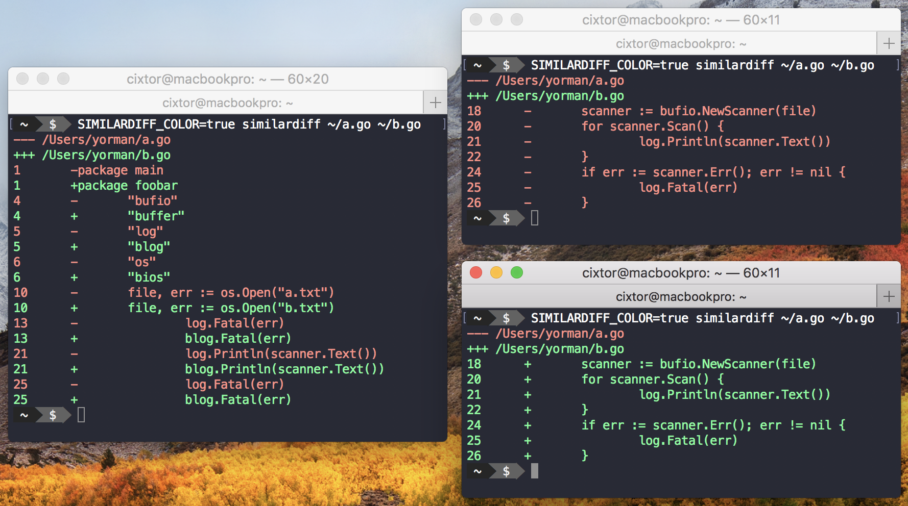

### Similar Diff

Command line tool to detect differences between two files and disregard an optional list of similarities.

In computing, the **diff utility** is a [data comparison](https://en.wikipedia.org/wiki/File_comparison) tool that calculates and displays the differences between two files. Unlike [edit distance](https://en.wikipedia.org/wiki/Edit_distance) notions used for other purposes, `diff` is line-oriented rather than character-oriented, but it is like [Levenshtein distance](https://en.wikipedia.org/wiki/Levenshtein_distance) in that it tries to determine the smallest set of deletions and insertions to create one file from the other. The `diff` command displays the changes made in a standard format, such that both humans and machines can understand the changes and apply them: given one file and the changes, the other file can be created.

Typically, `diff` is used to show the changes between two versions of the same file. Modern implementations also support [binary files](https://en.wikipedia.org/wiki/Binary_file). The output is called a "diff", or a patch, since the output can be applied with the Unix program patch. The output of similar file comparison utilities are also called a "diff"; like the use of the word "grep" for describing the act of searching, the word diff became a generic term for calculating data difference and the results thereof.

Comparison tools are used for various reasons. When one wishes to compare binary files, byte-level is probably best. But if one wishes to compare text files or computer programs, a side-by-side visual comparison is usually best. This gives the user the chance to decide which file is the preferred one to retain, if the files should be merged to create one containing all of the differences, or perhaps to keep them both as-is for later reference, through some form of "versioning" control.

File comparison is an important, and most likely integral, part of [file synchronization](https://en.wikipedia.org/wiki/File_synchronization) and backup. In backup methodologies, the issue of data corruption is an important one. Corruption occurs without warning and without our knowledge; at least usually until too late to recover the missing parts. Usually, the only way to know for sure if a file has become corrupted is when it is next used or opened. Barring that, one must use a comparison tool to at least recognize that a difference has occurred. Therefore, all file sync or backup programs must include file comparison if these programs are to be actually useful and trusted.
